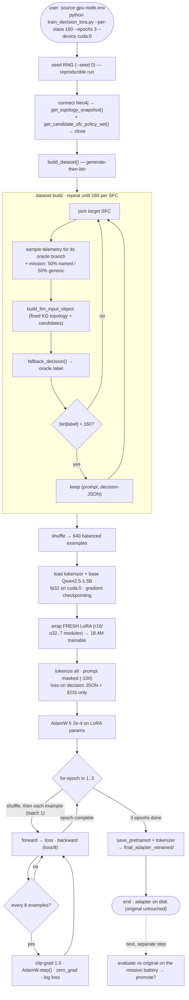

# Planner LoRA retrain (approach #3) — methods, resources, insights

**Status:** training in progress (2026-06-19). This documents the process *so far* — the
why, the exact steps, the setup, and the gotchas — so the run is reproducible and the
decisions are auditable. Evaluation/results are appended once training completes.

## 1. Why retrain

The planner's fine-tuned LoRA (`Qwen2.5-1.5B-Instruct` +
`netprompt_qwen_kg_rag_orchestrator/final_adapter`) **collapses to `LowLatencyVideoSFC`
for every mission**. The two cheaper fixes were exhausted (see
[runtime-planner-contracts.md](runtime-planner-contracts.md) §6c/§6d):

- **#1 constrained decoding (done, kept):** forces a complete, valid 6-key decision and
  stops the rambling — but can't change *which* valid option the model picks.
- **#2 prompt/few-shot (negative, reverted):** a mission→SFC rubric + 3 exemplars did
  **not** move the choice; the **base** model behaves identically and the original
  **unconstrained** run also emitted LowLatency. A 1.5B model doing one-shot JSON
  selection over a large structured input collapses to a single mode — not promptable.

So decision *quality* needs new weights. Approach #3 trains a **fresh LoRA** that
distills the system's known-correct decision policy into the model.

## 2. Safety first — preserve the original

Before touching anything, the shipped adapter was copied so we can roll back or compare:

```
cp -r netprompt_qwen_kg_rag_orchestrator/final_adapter \
      netprompt_qwen_kg_rag_orchestrator/final_adapter_original_backup   # 86 MB
```

The orchestrator's adapter path is configurable (`--adapter-path` / `NETPROMPT_LLM_ADAPTER`),
so switching between original and retrained is a one-flag change — no overwrite.

## 3. The oracle — where correct labels come from

The deterministic **`validator.fallback_decision`** already encodes the correct
mission/telemetry → SFC policy (it's what carries the system today when the LLM is
rejected). We distill *it* into the LoRA. Its mapping (branch order matters):

| Condition (first match wins) | SFC | path | mode |
|---|---|---|---|
| `emergency_alert_relay` **or** loss ≥ 3 **or** observed_loss ≥ 5 **or** any unavailable relay | ReliableRelaySFC | backup | multihop |
| `long_term_soil_monitoring` **or** battery < 40 | EnergyAwareSFC | primary | single_switch |
| `real_time_pest_detection` **or** delay ≤ 10 | LowLatencyVideoSFC | primary | multihop |
| bandwidth ≥ 30 | BandwidthOptimizedSFC | primary | single_switch |
| else | ReliableRelaySFC | backup | multihop |

Using the oracle as the label source means every training target is **already
validator-valid and grammar-valid** — training and the §6c constrained decoder agree by
construction.

## 4. Dataset — balanced, generate-then-bin

Script: [`train_decision_lora.py`](../network/milestone-II-latest/netprompt-milestone-II/train_decision_lora.py).

- **Fixed context from the live KG (once):** `get_topology_snapshot` +
  `get_candidate_sfc_policy_set` → the same `compact_topology_context` + candidate set
  the orchestrator uses at inference. Reused for every example (topology is static).
- **Inputs:** for a target SFC, sample telemetry that lands on its oracle branch
  (`_telemetry_for`), and **half the time** use a named mission (e.g.
  `emergency_alert_relay`), **half** a generic one (`routine_field_patrol`) so the model
  must read telemetry, not just memorize mission strings.
- **Generate-then-bin:** build the input, label it with `fallback_decision`, bin by the
  returned SFC, and keep an **equal count per SFC** — so branch-order subtleties can't
  skew balance and labels are always correct.
- **Example shape:** `prompt = build_inference_prompt(input_object)` (the *exact*
  inference format, `<|system|>…<|user|>…Input:{json}…<|assistant|>\n`), `target =`
  the compact 6-key decision JSON.

Verified before spending GPU time (per-class = 8 dry run): **8/8/8/8 across all four
SFCs**, labels correct, prompt ends at `<|assistant|>\n`.

Final dataset: **640 examples, 160 per SFC**, seeded (`--seed 0`) for reproducibility.

## 5. Tokenization — loss on the decision only

```
prompt_ids + (target_ids + EOS)         # input
[-100]*len(prompt_ids) + (target_ids+EOS)  # labels  -> prompt masked
```

The model is graded only on generating the decision, not on echoing the (large, fixed)
prompt. EOS is appended so it learns to **stop** at the closing brace (the original
model's rambling came from never learning to stop).

## 6. Model + LoRA — match the original, train fresh

- **Base:** `Qwen/Qwen2.5-1.5B-Instruct`.
- **Fresh LoRA**, hyperparams copied from the original `adapter_config.json` so the
  output is drop-in compatible: `r=16, lora_alpha=32, lora_dropout=0.05, bias=none,
  task=CAUSAL_LM`, target modules `q,k,v,o,gate,up,down_proj`.
- **Trainable: 18,464,768 params (1.18% of 1.56B).**

## 7. Training setup + the fp32 decision

- Manual loop (no `datasets` lib — not installed): **batch 1 + gradient accumulation 8**,
  `gradient_checkpointing` + `enable_input_require_grads`, AdamW `lr 2e-4`, grad-clip 1.0,
  **3 epochs**, `max_len 2600`.
- **fp32, deliberately.** The P100 is `sm_60`: **no bf16**, and fp16 Adam states
  underflow → unstable LoRA training. Full fp32 (1.5B ≈ 6 GB weights) fits in the 16 GB
  card with gradient checkpointing and is numerically stable. The saved LoRA weights are
  dtype-agnostic, so **inference still runs fp16**.

Launch command:

```
source deploy/gpu-node/gpu-node.env
~/netprompt-venv/bin/python train_decision_lora.py \
  --neo4j-uri bolt://localhost:7687 --neo4j-password netprompt123 \
  --out netprompt_qwen_kg_rag_orchestrator/final_adapter_retrained \
  --per-class 160 --epochs 3 --device cuda:0
```

## 8. System workflow (launch → end)

End-to-end, what the single launch command sets in motion:



**Walk-through:**

1. **Launch** — the user sources `gpu-node.env` (KG creds, tree root, device) and runs
   `train_decision_lora.py` with the run knobs (`--per-class`, `--epochs`, `--device`).
2. **Seed** — RNG + `torch` seeded from `--seed` so the dataset and run are reproducible.
3. **KG read (once)** — pull the topology snapshot + candidate SFC/policy set, build the
   compact context, then close the connection. This fixed context is reused for every
   example (the topology doesn't change between samples).
4. **Dataset build** — the generate-then-bin loop: sample a target SFC, synthesize
   telemetry that lands on its oracle branch, attach a named or generic mission, build the
   real input object, **label it with `fallback_decision`**, and keep it only while that
   SFC's bin is under 160. Result: 640 balanced, oracle-correct `(prompt, decision)` pairs,
   shuffled.
5. **Model + LoRA** — load the tokenizer and the **fp32** base model on `cuda:0` with
   gradient checkpointing, then attach a **fresh** LoRA (original hyperparams) — 18.4 M
   trainable params.
6. **Tokenize** — prompt tokens masked to `-100`; loss is computed only over the decision
   JSON + EOS, so the model learns to *generate* the decision and *stop*.
7. **Train** — three epochs, batch 1 with gradient accumulation of 8: forward→loss,
   backward (scaled), and every 8 examples clip-grad + `AdamW.step()` + zero-grad; loss is
   logged every 80 examples and at each epoch boundary.
8. **Save & end** — `save_pretrained` writes the adapter to `final_adapter_retrained/`
   (the original `final_adapter`/backup are untouched). Evaluation and the promote
   decision are a **separate** step (§11), so a run can never silently replace the adapter
   in use.

## 9. Resources

- **GPU:** 1× Tesla P100-16GB on `cuda:0` (the other P100, `cuda:1`, is reserved for M7
  Tier-2 regen serving). Training holds **~11 GB**, util pinned at **100%**.
- **Host:** 125 GB RAM (≈4 GB used — never the bottleneck), `~/netprompt-venv`
  (torch 2.3.1+cu121, transformers 4.46.3, peft 0.13.2, accelerate).
- **KG:** local Neo4j `bolt://localhost:7687` (read once for context).
- **Throughput:** ≈ **1.8 s/example** (fp32 + ~2400-token prompts) → 640×3 ≈ **~55 min**.

## 10. Insights / gotchas so far

- **Loss falls fast:** `0.33 → 0.17 → 0.12` within the first 240 examples — the targets
  are short, structured, and oracle-consistent, so the mapping is easy to fit. (Watch for
  over-fitting to the oracle — which is acceptable here: mimicking the correct rule-based
  policy *is* the goal.)
- **The prompt, not the model, dominates cost.** ~2400 of the ~2460 tokens per example
  are the **fixed topology JSON**; the model only needs the small mission/telemetry head
  + the short target. fp32 over that long sequence is why it's ~1.8 s/example. (A future
  speed-up: trim the topology in the *training* prompt, or train in fp16 with fp32 LoRA
  params — left as-is here for stability + inference-fidelity.)
- **Process-watching gotcha:** PyTorch renames the main thread to **`pt_main_thread`**, so
  `pgrep <name>` reports the job as gone. Use `pgrep -f train_decision_lora` or, more
  reliably, `nvidia-smi --query-compute-apps=pid,used_memory,process_name` to confirm a
  GPU job is alive. (This briefly looked like a crash mid-run; it wasn't.)
- **Why distillation works where prompting didn't:** prompting asks a frozen, biased model
  to behave; training *moves the weights* toward the policy. The oracle gives clean,
  balanced supervision the base model never had.

## 11. Results (2026-06-19)

> Standalone eval (method, full table, reproducible commands, promotion trade-off):
> **[planner-lora-eval.md](planner-lora-eval.md)**. Summary below.

Trained: 640 examples (160/SFC), 3 epochs, final mean loss **0.0066**, ~52 min on the
P100. Adapter saved to `final_adapter_retrained/` (and committed; original preserved).
Evaluated with constrained decoding on (the production setting) — every output was a
valid 6-key decision (`parsed_json`); the question is *which* SFC.

| Mission (telemetry) | Expected (oracle) | Original | Retrained |
|---|---|---|---|
| `emergency_alert_relay` | ReliableRelaySFC | LowLatency ✗ | **ReliableRelaySFC ✓** |
| `bulk_data_transfer` (bw 80) | BandwidthOptimizedSFC | LowLatency ✗ | **BandwidthOptimizedSFC ✓** |
| `real_time_pest_detection` (delay 6) | LowLatencyVideoSFC | LowLatency ✓* | **LowLatencyVideoSFC ✓** |
| `long_term_soil_monitoring` (batt 25) | EnergyAwareSFC | LowLatency ✗ | **EnergyAwareSFC ✓** |
| novel name `real_time_video` (delay 10) | LowLatencyVideoSFC | LowLatency | BandwidthOptimizedSFC ✗ |
| novel name `soil_moisture_survey` (batt 25) | EnergyAwareSFC | LowLatency | BandwidthOptimizedSFC ✗ |
| generic mission, delay 5 | LowLatencyVideoSFC | LowLatency | BandwidthOptimizedSFC ✗ |
| generic mission, batt 20 | EnergyAwareSFC | LowLatency | BandwidthOptimizedSFC ✗ |

\* the original only ever emits LowLatency, so it "passes" the LowLatency rows by accident.

**What worked.** The retrain **broke the always-LowLatency collapse**. Across the four
*known* mission types the model now picks correctly — effectively **4/4 vs the original's
1-mode behaviour**. Decisions are mission-sensitive and (via §7.2) always valid.

**What didn't.** The model learned **mission-name → SFC** associations more than the
underlying **telemetry reasoning**. For novel/generic missions where the correct answer
depends on numbers (delay ≤ 10 → LowLatency, battery < 40 → EnergyAware) it defaults to
**BandwidthOptimizedSFC** rather than reading telemetry. Likely causes: telemetry digits
sit deep in a ~2400-token prompt the 1.5B model under-attends to, and name is the easier
signal to fit.

**Promotion — see the corrected analysis in [planner-lora-eval.md §4](planner-lora-eval.md).**
**Promoted 2026-06-19:** `gpu-node.env` now sets `NETPROMPT_LLM_ADAPTER →
final_adapter_retrained` (original preserved + tracked for rollback). **Important
correction (2026-06-19 review):**
constrained decoding lets the fallback win *only when the LLM output is invalid* — but the
grammar makes it **always valid**, so under the production default (constrained-on) the LLM
choice is **used** and the fallback is **bypassed**. Therefore the current default
(original + constrained-on) **ships the wrong SFC** (mode-collapsed LowLatency) for every
non-LowLatency mission. The recommendation is now to **promote the retrained adapter** (the
only one correct under constrained-on); residual gap is the generic/telemetry-only cases,
to be closed by a telemetry-weighted retrain or a larger model.

Net: approach #3 **succeeded at its stated goal** (the model is no longer mode-collapsed
and now makes mission-appropriate choices on the known taxonomy); robust telemetry
generalization is the remaining gap.
