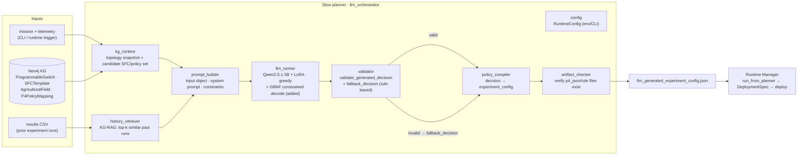
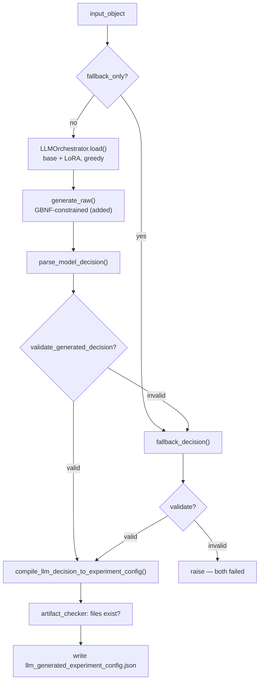

# Slow Planner — Design & Implementation (holistic)

**What this is.** The *slow planner* is the **outer / strategic loop** of NetPrompt: an
LLM KG-RAG orchestrator that, given a mission + live network state, **selects an SFC and
its P4 policy/path/relay** and compiles a deployable artifact. The **fast / runtime loop**
(the Runtime Manager, [runtime-manager-design.md](../design/runtime-manager-design.md)) then takes
that artifact onto the live P4/BMv2 network and adapts within the SFC's envelope. This
document covers the planner end-to-end — architecture, pipeline, components, the decision
contract, and the full arc from the original implementation to the extensions added here.

**Provenance.**
- **Original implementation — Bishwas & Kiran** (NetPrompt Milestone-II): the
  `llm_orchestrator` package, the Neo4j KG-RAG context, the fine-tuned
  Qwen2.5-1.5B + LoRA decision model, the validator + deterministic fallback, the policy
  compiler, and the `llm_generated_experiment_config.json` artifact.
- **Extensions — this work (2026-06):** seeding the planner's switch topology into the
  local KG so it runs on the consolidated node; **grammar-constrained decoding**; the
  **prompt/few-shot** experiment (negative); and a **LoRA retrain** to fix decision
  quality. All four are detailed in §7, and cross-referenced to
  [runtime-planner-contracts.md](../design/runtime-planner-contracts.md) and
  [planner-lora-retrain.md](planner-lora-retrain.md).

---

## 1. Role in the two-loop system

```
Intent/mission ─▶ SLOW PLANNER (this doc) ─▶ artifact ─▶ RUNTIME MANAGER ─▶ live P4/BMv2
       ▲                  │                                     │
       └──────── Results + analytics ◀── Verdicts/Escalations (KG) ◀┘
```

The planner **decides which SFC to run**; the runtime **executes and adapts it** and emits
verdicts the planner's learning loop can later consume (design
[runtime-manager-design.md §1a/§1b](../design/runtime-manager-design.md)). The two share the **Neo4j
KG** as the hub. The planner is "slow" because it runs per mission/re-plan, not per control
cycle. The handoff contract is [runtime-planner-contracts.md](../design/runtime-planner-contracts.md).

## 2. Architecture



## 3. The decision pipeline (end-to-end)

Two top-level functions in `orchestrate.py` (driven by `main()` / the CLI):

**`build_runtime_input_object(...)`** — assemble the LLM input:
1. **KG read** (`kg_context.Neo4jContextClient`): `get_topology_snapshot()` →
   `build_compact_llm_topology_context()`; `get_candidate_sfc_policy_set()`.
2. **Candidates**: if the KG has none → `fallback_candidate_actions()`; else
   `expand_candidate_actions_with_policy_aliases()` (adds the Milestone-II policy aliases).
3. **KG-RAG history** (`history_retriever`): load + normalize the results CSV,
   `build_live_current_row(...)`, `build_historical_context(... top_k=3)` — the *RAG*
   retrieval over prior experiment outcomes.
4. **Assemble** (`prompt_builder.build_llm_input_object`): mission/telemetry/topology/
   resource/candidate/history contexts **+ `orchestration_constraints`** (the allowed
   sfc/policy/path/relay sets the model and validator share).

**`run_pipeline(...)`** — decide + compile:



The validator is the **authority**: an invalid LLM decision is replaced by the
deterministic `fallback_decision` (and if *that* fails too, the run errors rather than ship
a bad config). This is why the system is robust even when the model is weak (§7).

## 4. Component reference (`llm_orchestrator/`)

| Module | Role |
|---|---|
| `orchestrate.py` | CLI + `build_runtime_input_object` / `run_pipeline`; writes the artifact. |
| `config.py` | `RuntimeConfig` — model/adapter/KG/CSV/device/token knobs from env+CLI. |
| `kg_context.py` | Neo4j reads: topology snapshot (switches by `role`+`status`, path links), candidate SFC↔P4 policy set; normalization into `allowed_*`. |
| `history_retriever.py` | Loads the results CSV; builds the live row + **KG-RAG** top-k historical context. |
| `prompt_builder.py` | `SYSTEM_PROMPT`, `build_llm_input_object` (+ `orchestration_constraints`), `build_inference_prompt`. |
| `llm_runner.py` | `LLMOrchestrator` (load base+LoRA, `generate_raw`), `parse_model_decision`, safe default; **+ `_grammar_processors` (added)**. |
| `validator.py` | `validate_generated_decision` (the contract check), `fallback_decision` (rule-based oracle), `_choose_policy/_choose_relay`. |
| `policy_compiler.py` | `compile_llm_decision_to_experiment_config` — decision → P4 program + per-switch rule paths + deployment block. |
| `artifact_checker.py` | Verify the compiled artifact's `p4_json`/rule files exist on disk. |
| `decision_grammar.py` | **Added** — GBNF for the decision JSON (constrained decoding, §7.2). |
| `utils.py` | JSON-safe serialization / text normalization helpers. |

Separately, `netprompt_qwen_kg_rag_orchestrator/` holds the **trained artifacts** (the
fine-tuned `final_adapter`, training checkpoints) — not code.

## 5. KG schema the planner reads

The planner is **KG-grounded**; it reads (and never writes) these node/edge types:

- **`ProgrammableSwitch`** `{id, role, status, thrift_port, device_id}` — `role` classifies
  access/primary_relay/backup_relay; `status` (active/standby/…) drives availability →
  `allowed_relays`. *(Status is also written live by the Runtime Manager's monitor — the
  shared-node feedback path.)*
- **`AgriculturalField`** `{id, latency_requirement_ms, bandwidth_requirement_mbps, …}` —
  the per-field SLA bounds (also read by the runtime's `build_envelope`).
- **`SFCTemplate`** `{id, max_latency_ms, min_bandwidth_mbps, …}` — the SFC library.
- **`P4PolicyMapping`** + `SFCTemplate-[:REALIZED_BY_P4_POLICY]->P4PolicyMapping` — the
  candidate SFC↔policy set.
- Relations: `PRIMARY_PATH`/`BACKUP_PATH`/`CONNECTED_TO_EDGE` (forwarding topology),
  `Drone-[:CONNECTED_TO]->` access switch.

## 6. The decision contract

The model must emit a **6-key JSON decision**, all validated against
`orchestration_constraints`:

```json
{ "selected_sfc": "<∈ allowed_sfc_ids>",
  "selected_policy": "<∈ allowed_policy_types, valid PAIR with sfc>",
  "selected_path": "primary | backup",
  "selected_relay": "<∈ allowed_relays>",
  "priority_class": "critical | high | medium | low",
  "deployment_mode": "single_switch | multihop" }
```

`policy_compiler` turns it into the artifact (`selected_sfc`, `policy_type`, `selected_path`,
`p4_json` + `access_rules`/`relay_rules`/`backup_rules`, `deployment` block, topology
summary), which the runtime adapter consumes
([runtime-planner-contracts.md](../design/runtime-planner-contracts.md)).

## 7. Extensions (this work, 2026-06)

The original system **ran on the controller-node KG** but was headless on the consolidated
node and the LLM made poor/incomplete decisions. Four changes, in order:

### 7.1 KG topology seed — made it runnable locally
The local KG had only the runtime's strategic nodes; the planner needs the **switch
topology** (`ProgrammableSwitch.role`, path relations, `P4PolicyMapping`). Added to
`controller/generate_kg.py` (applied via `runtime/tools/seed_kg.py`). Result: the planner
resolves `allowed_relays`/candidates and emits a valid, KG-grounded artifact.
*(contracts §6a / §6b.)*

### 7.2 Grammar-constrained decoding — valid, complete decisions (KEPT)
`decision_grammar.build_decision_gbnf` builds a GBNF **per request from the same
constraints the validator checks** (all 6 keys; `selected_sfc`+`selected_policy` bound as
**valid pairs**; KG-derived path/relay; fixed enums); `llm_runner._grammar_processors`
wires a `GrammarConstrainedLogitsProcessor` into generation (default-on; reuses the M7
`transformers-cfg` stack). The model previously emitted 4/6 keys and rambled past the
JSON; now it emits a complete, valid decision that **passes validation and is used**
(`llm_parse_status: parsed_json`). *(contracts §6c; 4 unit tests.)*

### 7.3 Prompt / few-shot — NEGATIVE result (reverted)
A mission→SFC rubric + few-shot exemplars did **not** make the 1.5B model
mission-sensitive — it still picks `LowLatencyVideoSFC` for every mission; the **base**
model behaves identically, and the original unconstrained output was already LowLatency.
A 1.5B model doing one-shot JSON selection over a large structured input collapses to a
single mode; prompting can't override it. Reverted. *(contracts §6d.)*

### 7.4 LoRA retrain — decision quality (PARTIAL WIN)
Distilled the deterministic `fallback_decision` oracle into a **fresh LoRA** (640 balanced
examples, 3 epochs, loss 0.0066; original preserved as `final_adapter_original_backup`,
retrained committed as `final_adapter_retrained`). **Result:** the always-LowLatency
collapse is **fixed** — the model now picks correctly across all 4 *known* mission types
(emergency→Reliable, bulk→Bandwidth, pest→LowLatency, soil→Energy). **Gap:** it learned
mission-*name* associations more than *telemetry* reasoning, so novel/generic missions
default to BandwidthOptimized. **Promoted 2026-06-19** (`gpu-node.env`
`NETPROMPT_LLM_ADAPTER → final_adapter_retrained`): under the production constrained-on
default the *original* adapter ships its mode-collapsed LowLatency choice
(valid → used → fallback bypassed), whereas the retrained one is correct on the known
taxonomy — so the retrained adapter is now the default (original preserved for rollback).
Full method, eval table, and the corrected promote analysis:
[planner-lora-retrain.md](planner-lora-retrain.md) · [planner-lora-eval.md §4](planner-lora-eval.md).

## 8. Known limitations & open items

- **LLM decision quality is the weak link — and the fallback does NOT backstop it under
  constrained decoding.** Constrained decoding (§7.2) lets the deterministic fallback win
  *only when the LLM output is invalid*; since the grammar makes output always valid, the
  LLM's choice is used. So decision quality rests on the *adapter*: the original is
  mode-collapsed (wrong on non-LowLatency missions), the retrained one is correct on the
  known mission taxonomy (§7.4) — hence the promote recommendation. The fallback only
  decides everything when constrained decoding is *off* (then the LLM is unused).
- **Model scale.** 1.5B is the floor for this structured reasoning; a larger model behind
  the same constrained-decoding seam is the cheapest path to better judgment if the
  retrain underperforms.
- **Trigger/transport.** The planner writes an artifact and stops; invoking the runtime
  off it is the file-transport adapter (`run_from_planner`) — the KG-`PlannedDeployment`
  node + poll transport remains a future option (contracts §5/§6a).
- **Learning loop — CLOSED (analytics → decision context).** The outer-loop "Results +
  analytics" (`llm_orchestrator/analytics.py` →
  [components/planner-analytics.md](../components/planner-analytics.md)) aggregates the
  runtime's `Verdict`/`EscalationTicket` history into a **per-SFC reliability signal**, and
  `build_runtime_input_object` now **folds that signal back into every decision** as
  `input_object.runtime_feedback` (best-effort; `NETPROMPT_PLANNER_FEEDBACK=0` to disable).
  So the slow loop sees how its prior choices fared. *Honest caveat:* the current 1.5B
  model doesn't yet *exploit* the signal (it wasn't trained on the field; verified it still
  decides correctly with it present), and the escalation-rate conflates "wrong SFC" with
  "unachievable SLA on this fabric" — so it's advisory. Truly *acting* on it needs a
  feedback-aware retrain (or a stronger model); the feedback **path** is wired and robust.

## 9. Provenance & cross-references

- Original planner: **Bishwas & Kiran** (Milestone-II `llm_orchestrator`, KG-RAG, LoRA).
- Extensions (this work): §7 above.
- Related docs: [runtime-manager-design.md](../design/runtime-manager-design.md) (fast loop) ·
  [runtime-planner-contracts.md](../design/runtime-planner-contracts.md) (handoff + the §6
  integration log) · [planner-lora-retrain.md](planner-lora-retrain.md) (the retrain).
