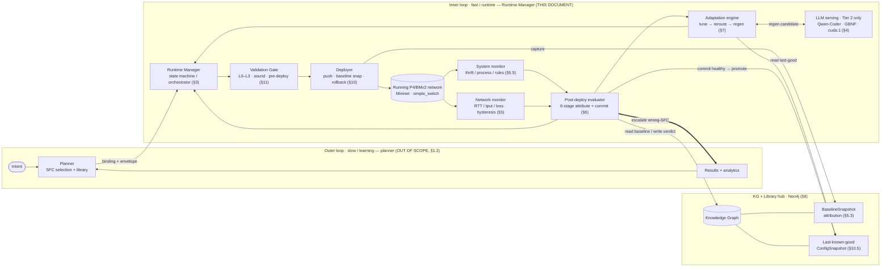
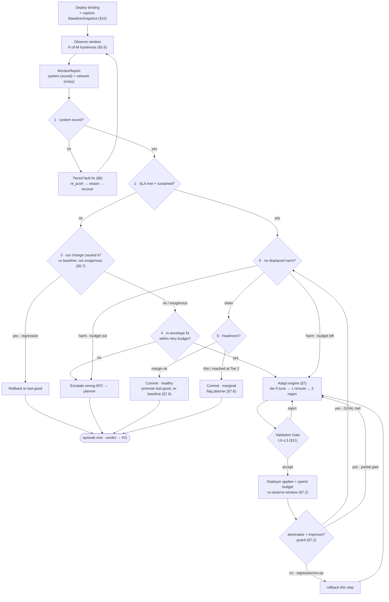

# Runtime Manager — Design Document

**Status:** Draft for review (v2 — folds in the updated architecture + evaluator diagrams)
**Owner:** Kevin (inner-loop / runtime)
**Out of scope (owned by Kiran):** Planner, intent ingestion, SFC selection/reasoning, the strategic learning loop
**Targets:** NetPrompt Milestone III, built on the Milestone II BMv2/P4 foundation

> **What changed in v2.** The KG now stores **baseline snapshots** and a **last-known-good registry**; **Deploy captures a baseline snapshot**; the evaluator **reads** baselines + intent targets and **records every verdict + attribution trace** to the KG (bidirectional record/read edge). The attribution ladder gained a **commit path** (displaced-harm + headroom checks) and an explicit **retry budget**; adaptation is now **tiered** (tune → reroute → regen). The model is **open-weights** (peer-review reproducibility), used only in the top adaptation tier.

---

## 1. Purpose & Scope

The two architecture diagrams describe a two-loop control system around a central **KG + Library** hub:

- **Outer loop (slow / learning):** `Intent → Planner → KG ← Results+analytics`. Strategic — reasons about *which* SFC to run and curates the validated-SFC library. **Kiran's planner; out of scope here.**
- **Inner loop (fast / runtime):** `Runtime Manager → Validation Gate → Deploy (baseline snap) → Running network → Monitor → Post-deploy evaluator → (back to Runtime Manager)`. This document specifies the **Runtime Manager** and the inner-loop components it drives.

The Runtime Manager takes an already-chosen, already-validated SFC, gets it safely onto the running P4/BMv2 network, watches the result against a captured baseline, and **autonomously** decides whether to commit (healthy/marginal), re-push, roll back, or adapt within the SFC's envelope. The one decision it does not make autonomously is "this SFC is wrong" — escalated to the planner at a human checkpoint.

### 1.1 What we build

| Component | Diagram box | Responsibility |
|---|---|---|
| Runtime Manager | "Runtime Manager · tiered in-envelope" | Inner-loop orchestrator / state machine |
| Validation Gate | "Validation Gate · pre-deploy · sound" | Pre-deploy soundness checks (hot path) |
| Deployer | "Deploy · push · baseline snap" | Push P4 + rules + QoS to a **live, persistent** network; capture config + baseline snapshots; rollback/re-push primitives |
| Snapshot stores | KG "baselines · last-known-good" | `ConfigSnapshot` (rollback) + `BaselineSnapshot` (attribution), both KG-resident |
| System monitor | "System monitor · sound" | Process/thrift/rule-install health → switch status |
| Network monitor | "Network monitor · noisy" | Per-flow RTT/throughput/loss vs envelope, with hysteresis + headroom |
| Post-deploy evaluator | "Post-deploy evaluator · attribute · record" | The 6-stage attribution + commit ladder; **records every verdict** to KG |
| Adaptation engine | "Adapt with severity tier" | Tiered tune → reroute → regen, bounded by Envelope + retry budget |

### 1.2 What we explicitly do NOT touch (planner boundary)

The Runtime Manager **consumes** decisions and **never** makes strategic ones:

- We do **not** ingest intent, reason about missions, or select an SFC.
- We do **not** write new/validated SFC templates into the KG library.
- We do **not** implement the results→planner learning analytics — we only **emit verdicts** that `Results + analytics` aggregates for the planner.
- We do **not** implement the planner side of the wrong-SFC escalation — we only emit the ticket against a contract we define jointly.
- We do **not** set priorities or pick which flow "wins." When meeting the target would harm a non-target flow, the runtime either finds a config that harms *no one* or escalates; deciding who absorbs a loss is the planner's call (using `priority`, which we read but never act on).

Planner-territory files that **must not be modified**:
[controller/select_template.py](controller/select_template.py),
[controller/run_selected_sfc.py](controller/run_selected_sfc.py),
[path_aware_sfc_selector.py](network/milestone-II/experiments/path_aware_sfc_selector.py),
[select_sfc_for_scenario.py](network/milestone-II/experiments/select_sfc_for_scenario.py).

---

## 1a. System Architecture

This section gives the consolidated picture the rest of the document then specifies
component-by-component. The system is a **two-loop control architecture around a central
KG + Library hub**: a slow *outer* learning loop (the planner — out of scope, §1.2) and a fast
*inner* runtime loop (the Runtime Manager — this document). The inner loop takes an
already-validated SFC binding, gets it safely onto a **persistent** P4/BMv2 network, watches the
result against a captured baseline, and decides — autonomously, within the SFC envelope — to
commit, roll back, or adapt.



**Four layers.** Read top-down, each layer only depends on the one below it — which is what keeps
the LLM confined to a single, fail-safe tier:

| Layer | Components | Property | Spec |
|---|---|---|---|
| **Knowledge** | KG: baselines, last-known-good, intent targets, verdict/trace records | persistent, bidirectional record/read | §8, §5.3 |
| **Decision** | Post-deploy evaluator (6-stage ladder) + Adaptation engine (tiered) | one goal state; sound/noisy split | §6, §7 |
| **Control** | Validation Gate (pre-deploy, sound) · Deployer (live re-install) · System + Network monitors | gate = authority; deploy reversible | §11, §10, §5 |
| **Data plane** | Persistent Mininet + BMv2 `simple_switch`, driven out-of-band via thrift + `mnexec` | never torn down per iteration | §10.3, §13.5 |

**Where the model sits.** The LLM is invoked **only in the top adaptation tier (regen, Tier 2)** and
its output is doubly contained — grammar-constrained at decode time and re-checked by the gate
before any rule reaches a switch (§4, §11). Tiers 0–1 are deterministic, so an unavailable model
degrades capability (escalate sooner), never safety (§7.4).

**Physical deployment (consolidated node).** In the Milestone-III bring-up all four layers run on a
**single GPU node**: the persistent testbed (Mininet/BMv2), the Runtime Manager, a **local Neo4j**,
and in-process LLM serving on the **second P100 (`cuda:1`)** via HF transformers + a transformers-cfg
GBNF logits processor (vLLM is unsupported on the P100's `sm_60`, so there is no separate serving
process). The earlier multi-node split (controller-node KG + network-node testbed) remains the
logical reference; the consolidated node is the operational one.

The autonomous actions and the planner boundary this architecture enforces are enumerated in §3; the
per-component responsibilities are the §1.1 table.

---

## 1b. System Workflow

This is the inner loop's behaviour for **one episode**, end to end: deploy → observe → attribute →
act → commit-or-escalate. It consolidates the evaluator ladder (§6), the adaptation engine (§7), and
the gate (§11) into one picture; the numbered stages below are exactly the evaluator's six stages.



**Walk-through** (each step keyed to its section):

1. **Deploy + baseline** — the gate vets the full binding pre-deploy (§11 entry 1); the deployer
   pushes P4 + rules + QoS to the *live* network and captures a `BaselineSnapshot` of all flows for
   later attribution (§10, §5.3).
2. **Observe** — the monitors sample a full window with K-of-M hysteresis, producing one
   `MonitorReport` (system = sound, network = noisy) (§5).
3. **Stage 1 — system sound?** If a switch/process/rule-install is unhealthy, take the **tiered fault
   fix** (re-push the same revision → restart → recover table state by key), then re-observe. Fault
   fixes draw **no** retry budget (§6).
4. **Stage 2 — SLA met & sustained?** If yes, jump straight to the **commit path** (stage 5). If no,
   ask who caused it.
5. **Stage 3 — did *we* cause it?** A regression vs the baseline **and** no exogenous shift → roll
   back to last-known-good (§5.7, §6). A regression that coincides with an environment change is
   attributed outward → fall through to adapt, not rollback.
6. **Stage 4 — in-envelope fix left?** With budget remaining, enter the **adaptation engine**;
   otherwise escalate wrong-SFC to the planner with the full trace.
7. **Adapt ladder + gate** — the engine proposes one candidate at the current cost tier
   (0 tune → 1 reroute → 2 regen), the **gate** (L0–L3) must accept it before it touches the
   data plane; **gate rejects spend no budget** but join the finite `tried` set (and Tier 2 caps at
   K rejects → escalate). An accepted candidate is applied, budget is spent, and the result is
   re-observed (§7.1–7.3, §11).
8. **Domination guard** — keep a step only if it **dominates and improves** (never regress the
   target, never raise harm count); a regressing or no-op step is rolled back and the ladder
   continues. On reaching the goal (target met *and* no harm) go to the commit path (§7.2, §7.4).
9. **Stage 5 — displaced harm?** The goal already guarantees harm-free, so this passes by
   construction on the adapt exit; on the direct stage-2 path it re-checks neighbours vs baseline.
   Unrelieved harm with budget left re-enters the engine; with budget exhausted it escalates (§6, §7.3).
10. **Stage 6 — headroom?** Comfortable margin → **commit healthy** (promote last-known-good,
    re-baseline, reset budget). Thin margin — **or the goal was reached only at Tier 2** — →
    **commit marginal** and flag the planner on the slow loop (§7.5, §7.6).

Every terminal verdict (healthy, marginal, rollback, escalation) writes a `Verdict` + attribution
`trace` to the KG, which `Results + analytics` aggregates for the planner's next outer-loop pass (§6, §8).

---

## 2. Current System (as-is) and How It Maps to the Diagrams

Today the Milestone II pipeline is a single linear shell script,
[run_netprompt_milestone2_final.sh](network/milestone-II/experiments/run_netprompt_milestone2_final.sh),
that runs once per scenario and exits — no persistent loop, no rollback, no attribution. The Runtime Manager turns this one-shot pipeline into a closed loop.

| Inner-loop role | Exists today as | Gap to close |
|---|---|---|
| SFC → binding | [sfc_to_multihop_mapper.py](network/milestone-II/experiments/sfc_to_multihop_mapper.py), [sfc_to_p4_mapper.py](network/milestone-II/experiments/sfc_to_p4_mapper.py) | Reusable; wrap as a binding function. Multihop map covers only 2 of 4 SFCs. |
| Deploy | rule-install + `tc` inside [dynamic_sfc_p4_multihop_experiment.py](network/milestone-II/experiments/dynamic_sfc_p4_multihop_experiment.py) | Fused with topology-build + measurement, and **tears the network down per run**. Must become a standalone, reversible primitive over a **persistent** network. |
| Running network | Mininet + BMv2 `simple_switch` | Must persist across loop iterations. |
| Monitor | ping/iperf in the experiment + [parse_and_push_final_results.py](network/milestone-II/results/parse_and_push_final_results.py) | One-shot + intrusive. Must become repeatable, **passive-first**, per-flow, with hysteresis. |
| Baseline | none | New: capture a steady-state **baseline snapshot at deploy** (all flows). |
| Evaluator | none (only result parsing) | Build the 6-stage ladder + commit path. |
| Live switch state | [update_topology_state.py](network/milestone-II/experiments/update_topology_state.py) writes status **from a hardcoded per-scenario table** | Replace with **monitor-computed** status (see §5.4). This is the key integrity fix. |

Mechanisms we reuse: P4→BMv2 JSON; rule install via `simple_switch_CLI --thrift-port` (s1=9090, s2=9091, s3=9092); host QoS via `tc qdisc`; metric parsing regexes; Neo4j KG on `controller-node`.

---

## 3. Responsibilities & Boundaries

The Runtime Manager owns five autonomous actions plus one escalation, matching the v2 ladder:

1. **Commit (healthy)** — system sound, SLA met with margin, no displaced harm. Promote config to last-known-good; keep observing.
2. **Commit (marginal)** — as above but thin margin (or recovery needed the LLM tier). Commit, but **flag the planner** on the slow loop.
3. **System fault → tiered fix** — program/runtime unhealthy. Re-push or rollback. Autonomous.
4. **Rollback to last-good** — SLA violated and our change caused it (vs baseline). Autonomous.
5. **Adapt (tiered, in-envelope)** — SLA violated *or* a neighbor harmed, and an in-envelope fix may exist within the retry budget. Autonomous.
6. **Escalate wrong-SFC → planner** — no in-envelope config satisfies the goal within budget. Hand off at the human checkpoint. **Not autonomous.**

Autonomy is bounded by the SFC envelope. The runtime may retune, reroute, and regenerate rules *within* the chosen SFC; choosing a *different* SFC is the planner's job.

---

## 4. Model & Reproducibility (open-weights)

This is peer-reviewed research, so the model must be **open access and reproducible** — a reviewer has to download the exact weights and re-run the pipeline. This rules out frontier API models (Claude/GPT).

- **Model:** **Qwen2.5/3-Coder** (Apache-2.0 on mainline checkpoints), sized to the controller-node GPU. Strong code/structured-generation capability with a clean open-source license. **Granite-Code** / **StarCoder2** kept as open-provenance baselines (open training data) for the comparison table; **DeepSeek-Coder** as a third permissive option.
- **Where it runs:** only in the **top adaptation tier (regen)** — see §7. Tiers 0–1 are deterministic, so the LLM being unavailable degrades capability (escalate sooner), never safety.
- **Constrained output:** schema/grammar-constrained decoding (Outlines / vLLM guided decoding / llama.cpp GBNF) so output is always syntactically valid table entries; the Validation Gate enforces envelope bounds before anything reaches a switch.
- **Reproducibility (bake into methodology):** pin the exact HF revision/commit; pin serving stack + version; **greedy/deterministic decoding**; report the verbatim prompt template; state the license. Consider reporting a **multi-model comparison** (Qwen-Coder vs DeepSeek-Coder vs a Granite/StarCoder open baseline) — turns "why this model?" from an objection into a contribution.

---

## 5. Monitor + Baseline (the substrate)

Everything downstream is logic over the `MonitorReport` contract and the baseline. This is built first.

### 5.1 Flow model — per **field**

Traffic is drone → edge. Each `AgriculturalField` ([generate_kg.py](controller/generate_kg.py)) carries its own `latency_requirement_ms`, `bandwidth_requirement_mbps`, `priority`; drones are assigned to fields. So:

- A **flow** = one field's drones' traffic, with that field's requirements as its envelope.
- **Target flow** = the field/SFC this deployment is for. **Non-target flows** = the other fields sharing the fabric.
- **Displaced harm** = a non-target field pushed below its *own* requirements vs baseline. Harm is grounded in existing KG data; the threshold is intent-given (the field's own requirements), not invented by the runtime.

Evaluation is at **field granularity** (not per-drone) — that's where requirements live.

### 5.2 Measurement — passive-first

- **Throughput / loss:** read **per-port packet/byte counters passively**. **Decided (S0 spike C6, 2026-06-14): OS-level veth interface stats** (`/sys/class/net/<intf>/statistics/`) on the **switch-side** ports — zero P4 change, per-port granularity, readable directly in the root namespace (no `mnexec`). The port→field map is **derived from `host_map`** (`network_monitor.port_map_from_hosts`: drone `dN` → s1 port `N`) so it is a single source of truth with the deployer's TUNE targeting. The P4-counter alternative (recompile) is the fallback if veth granularity ever proves too coarse for loss.
- **Latency:** lightweight always-on `ping` from the drone namespace (negligible load). *Implementation note:* ping exits non-zero on loss, so the runner must not treat that as a command failure.
- **`iperf`:** **only** for deliberate on-demand checks — chiefly confirming a backup path's capacity *before* committing a reroute. Never for continuous monitoring (it would congest the fabric it measures, and would *cause* the harm it's meant to detect).

> **Throughput needs real traffic (node-verified).** Counters measure whatever the SFC is actually carrying; on an idle fabric every field reads ~0 Mbps and therefore *fails* its bandwidth bound — including at baseline. Harm detection (§5.4, `displaced_harm`) compares **met-at-baseline → unmet-now**, so a neighbour that already looks unmet at baseline can never register as harmed. In production the SFC carries continuous traffic; in evaluation, representative load must be running **through both the baseline window and the observation** for throughput/harm to be meaningful.

> **Measurement point: per-field throughput is at the ACCESS link, upstream of the shared bottleneck (node-verified, M6).** The `s1-eth{N}` counters measure drone→s1 (what each field *sends*), which is upstream of the shared relay link (`s1→s2`, ~60 Mbit) where fields actually contend. So **shared-link contention is invisible to per-field throughput** — both an aggressor and its victim read full offered load regardless of shaping. Contention instead shows as **loss and latency** (drops + queuing at the bottleneck), read via ping — measured at the saturated relay, F2's RTT was ~246 ms vs ~55 ms once relieved (a precise 4× signal; ping-loss is too coarse with few packets). **Consequence:** the contention-harm scenario (§7.3) is diagnosed/relieved on **latency**, not bandwidth. (Per-field *bottleneck* throughput is not directly measurable — the `forward_table` merges all fields onto the one shared edge entry, so the bottleneck has no per-field counter.)

### 5.3 Snapshots — two artifacts, both KG-resident

Captured by the Deployer, keyed by `correlation_id`:

```python
@dataclass
class ConfigSnapshot:        # → LastKnownGood registry; for rollback
    correlation_id: str
    sfc: str
    binding: dict            # p4_json + s1/s2/s3 rule files + tc policy + active relay
    switch_table_dumps: dict # exact installed entries, for deterministic re-apply

@dataclass
class BaselineSnapshot:      # → attribution (rungs 3 & 5)
    correlation_id: str
    per_flow: dict           # {field_id: {rtt_avg, throughput, loss}} for ALL flows
    switch_status: dict
    captured_over_window: int   # fresh, pre-cutover, STEADY-STATE window (not one probe)
    timestamp: str
```

**Baseline = a fresh pre-cutover steady-state window** of all flows, captured at deploy. This isolates *our change* as the only difference between before/after, making rung-3 causality non-circular.

### 5.4 The MonitorReport contract

```python
@dataclass
class FlowMetrics:
    field_id: str
    rtt_avg_ms: float; throughput_mbps: float; loss_percent: float
    requirement: Envelope        # this field's requirements (read from KG)
    met: bool                    # within requirement, POST-hysteresis
    margin: float                # normalized distance inside the bound; <0 = violating

@dataclass
class MonitorReport:
    correlation_id: str
    switch_status: dict          # {s1,s2,s3: Active|Degraded|Failed|Standby}
    system_sound: bool           # rung 1
    target: FlowMetrics
    non_target: list[FlowMetrics]
    target_sla_met: bool         # rung 2  (and adapt's goal half)
    vs_baseline: dict            # current−baseline deltas
    exogenous_shift: bool        # did underlying link conditions change vs baseline? (rung 3 needs this)
    displaced_harm: list[str]    # non-target field_ids below their own req vs baseline → rung 5
    headroom: float              # min margin across satisfied flows → rung 6 (thin if < τ)
    path_confidence: dict        # {primary,backup: observed|inferred}  (idle paths are inferred)
```

| Consumer | Reads |
|---|---|
| rung 1 | `system_sound` |
| rung 2 / adapt hard half | `target_sla_met` |
| rung 3 | `vs_baseline` + `exogenous_shift` |
| rung 5 / adapt goal half | `displaced_harm` |
| rung 6 | `headroom` |
| adapt `diagnose()` | `target.margin`, `non_target[*].margin` |
| reroute feasibility | `path_confidence` |

### 5.5 Status derivation — replacing the hardcoded table

[update_topology_state.py](network/milestone-II/experiments/update_topology_state.py) reads switch health from the scenario *label* (circular — a reviewer will flag it). Replace with observation:

| Status | Derived from |
|---|---|
| `Failed` | process dead **or** thrift unreachable |
| `Degraded` | alive+reachable, but the **path through it** violates SLA, sustained |
| `Active` | alive+reachable + path meets SLA |
| `Standby` | healthy relay not currently carrying traffic |

Path health → switch status is attributed via the flows currently *using* that path. `kg_client` writes `ProgrammableSwitch.status`; [kg_path_selector.py](network/milestone-II/experiments/kg_path_selector.py)'s status→path logic then works unchanged on real state.

**`system_sound` (rung 1) vs. `switch_status` (per-switch) — node-clarified.** Rung 1 bails the whole episode to `system_fault` with no adaptation, so `system_sound` must mean *the fabric genuinely can't carry traffic*, not merely *something is wrong*. The rule (`network_monitor._system_sound`): **unsound iff `s1` is Failed OR both relays are Failed** (no path exists). A **single** relay death stays *sound* on purpose — it is recoverable, so the loop should reach rung 4 and **reroute to the surviving relay** rather than bail. `Failed` means a dead process/thrift; `Degraded` (alive but SLA-violating) is **not** a fault and is handled by normal adaptation. (An earlier "any switch alive" rule was wrong: it called s1-dead "sound".)

**Idle-path observability:** a Standby backup carries no traffic, so its health is *inferred*, not observed (`path_confidence`). This is why a Tier-1 reroute onto it requires the one-shot active `iperf` capacity check before commit.

### 5.6 Hysteresis

Per-flow sliding-window state machine so noise never triggers action or a premature success call:

```
ok → suspect → violating     (needs K bad probes within the last M — windowed, not strictly consecutive)
violating → recovering → ok  (needs K good probes within the last M — windowed, not strictly consecutive)
```

`*.met` reflects the post-hysteresis state. The adapt engine's "re-observe over a full window" uses the same machine. *Node note:* `network_monitor.observe_window()` samples a **fresh** K-of-M window of M probes per call (each `observe` is independent), returning the sustained verdict for the current config — which matches the loop's one-observe-per-`apply` usage. (Probes are currently sampled back-to-back; spacing them by `PROBE_INTERVAL_S` is a fidelity refinement for flapping conditions, not needed for sustained faults.)

### 5.7 Exogenous-shift detection (for rung-3 causality)

Rung 3 ("our change caused it?") cannot be a pure baseline metric-diff: if the baseline was captured before an environment shift (network fine at deploy, then conditions degrade mid-observation), a metric drop *looks* like our change caused it and triggers a wrongful rollback. The network monitor therefore exposes `exogenous_shift` — **did the underlying link characteristics change vs. baseline, independent of our config?** Estimated from passive path characteristics (e.g., measured per-link delay/loss/available-bandwidth drifting on links we didn't touch; on the testbed this corresponds to the scenario knob changing, in production to measured path conditions). Rung 3 attributes to *us* only when a regression occurs **and** `exogenous_shift` is false. *Node implementation:* read by `parse_qdisc` over the **switch-side env veths** (`s1-eth{N}`) — the unmanaged links where, under Model B (§10.2), the scenario impairment lives — and compared to the baseline qdisc (`pipeline.qdisc_shifted`). Because the deployer's TUNE only touches drone-`eth0`, a knob change can never be misread as an exogenous shift.

---

## 6. The Post-Deploy Evaluator (v2: attribution + commit ladder)

Inputs: system monitor (sound), network monitor (noisy), and **KG inputs** (baselines + intent targets). Every terminal verdict is **recorded to the KG**.

```
1 · System healthy? (sound)
      no  → System fault: tiered fix (re-push / rollback) → RM
      yes ↓
2 · SLA met, sustained? (noisy · hysteresis)
      yes → COMMIT PATH (stage 5)
      no  ↓
3 · Our change caused it? (vs baseline snapshot)
      yes → Rollback to last-good (registry · provenance) → RM
      no  ↓
4 · In-envelope fix left? (retry budget ≤ N)
      yes → Adapt with severity tier (tune / reroute / regen) → RM
      no  → Wrong-SFC: escalate → Planner · human checkpoint

COMMIT PATH:
5 · No displaced harm? (non-target flows vs baseline)
      harm  → adapt to relieve (Option B, §7); if no harm-free config in budget → escalate wrong-SFC
      clean ↓
6 · Headroom check (margin vs barely met)
      margin ok → Commit · healthy (no data-plane change; promote LKG, re-baseline, reset budget — §7.6)
      thin      → Commit · marginal (flag planner · slow loop; also ends episode — §7.6)
```

Notes:
- **Rung-1 tiered fix order:** re-push the *same* revision first (recovers transient process/install faults cheaply), then rollback to last-known-good if the re-push fails or the fault recurs. System fixes are not adapt attempts and draw no retry budget.
- **Rung 3 causality** = `(target margin dropped by more than `REGRESSION_EPS`) AND (not exogenous_shift)`. A regression coinciding with an exogenous shift (link conditions changed underneath us, §5.7) is attributed to the environment → skip rollback, go to rung 4. Without the `exogenous_shift` guard the evaluator would wrongly roll back environment-caused regressions. The `REGRESSION_EPS` (0.02) deadband was added after the real monitor showed `vs_baseline` jitters ~1e-7 on idle flows — without it, measurement noise triggered spurious rollbacks (node-verified). Conservative by design. *(The analogous deadband is still owed on the headroom/`improves` paths — §13b.A.)*
- **Stage 5 uses Option B** (see §7): harm is first treated as an in-envelope problem to adapt around; escalation only when no harm-free config exists in budget.
- **Recording:** healthy, marginal, rollback, and escalation verdicts all write a `Verdict` + attribution `trace` to the KG. `Results + analytics` aggregates these for the planner.

> **Bounds must be calibrated to the real testbed (node-verified, important for evaluation).** Measured edge round-trips are **~40 ms on the primary path and ~52 ms on the backup**. So a field whose KG bound is, e.g., LowLatency's **20 ms** is **physically unachievable** on this fabric — with the real monitor it can never pass rung 2, so the loop exhausts its tiers and *correctly* escalates ("no in-envelope fix"). This is the fixtures-vs-real-testbed gap (risk register): the synthetic scenario models assumed reachable numbers; the wires have their own physics. For live evaluation, either pick bounds the path can meet (the 50 ms field is met on primary), expect escalation as the correct outcome, or relax the bound / reduce link delay to calibrate. The off-node scenario fixtures remain the algorithmic spec; the live runs are where bounds get reconciled to hardware.

---

## 7. The Unified Adaptation Engine

Rung-4 adaptation and stage-5 harm-relief collapse into **one engine chasing one goal state**:

```
GOAL(report) ≡ report.target_sla_met AND not report.displaced_harm
```

Both callers want *target healthy and nobody harmed*; they just enter from different failures (rung 4: target failing; stage 5: neighbor harmed). `diagnose()` sees which half is false and picks a knob to fix it without breaking the other.

### 7.1 Tier ladder (natural cost order)

- **Tier 0 — tune (deterministic):** adjust `tc`/queue params within `knob_ranges` (from `apply_sfc_queue_policy`).
- **Tier 1 — reroute (deterministic):** flip primary↔backup relay, if `legal_paths` allows. Requires an active capacity check before committing onto an *inferred* (idle) path.
- **Tier 2 — regen (LLM, constrained):** Qwen-Coder regenerates the SFC's P4 table rules — schema-constrained, greedy, validated by the gate. Last resort before escalation; LLM-only tier.

### 7.2 Engine

```python
GOAL = lambda r: r.target_sla_met and not r.displaced_harm

def dominates(post, pre):            # never accept a regression
    if pre.target_sla_met and not post.target_sla_met:     return False
    if len(post.displaced_harm) > len(pre.displaced_harm): return False
    return True

def improves(post, pre):             # strict progress on some axis
    return (post.target_sla_met and not pre.target_sla_met) \
        or (len(post.displaced_harm) < len(pre.displaced_harm)) \
        or (post.headroom > pre.headroom + EPS)

def adapt(spec, report, budget):              # budget is EPISODE-scoped, shared
    tried, tier, cur, trace = set(), 0, report, []
    while budget.remaining() > 0:
        cand = propose(diagnose(cur, spec.envelope), tier, spec.envelope, exclude=tried)
        if cand is None:
            if tier < 2: tier += 1; continue          # escalate cost tier
            return escalate("all tiers exhausted", trace)   # implicit Option A
        if tier == 1 and path_idle(cand) and not active_capacity_ok(cand):
            tried.add(cand); continue                 # backup can't carry it
        if not gate.check(cand, spec.envelope):
            tried.add(cand); continue
        pre_cfg = snapshot.capture()
        deployer.apply(cand); budget.spend(1)
        post = monitor.observe_window()               # hysteresis, full window
        tried.add(cand)
        if GOAL(post):
            return success(post, tier, trace)         # → evaluator commit path
        if dominates(post, cur) and improves(post, cur):
            cur = post                                # keep gain, hill-climb
        else:
            deployer.rollback(pre_cfg)                # regression/no-op → undo
    return escalate("budget spent", trace)
```

### 7.3 `diagnose()` + `propose()` (the candidate generator)

`diagnose(report, envelope)` surfaces the worst violation `{who: target | harmed-field, metric, severity}` from the negative margins. `propose(diag, tier, envelope, exclude)` turns it into one candidate at the current tier; the domination guard + re-observe catch mispredictions, so `propose` only needs to be *directionally* right.

**Knob-effect model** (deterministic tiers). Legal knobs are SFC-specific (`Envelope.knob_ranges`) and include only genuine control levers — pfifo queue depth, tbf rate cap — **never `netem` impairments**, which model the environment/SFC semantics and are not ours to tune:

| Knob (direction) | latency | tput | loss | note |
|---|:--:|:--:|:--:|---|
| pfifo limit ↑ | ↑ | ↑ | ↓ | latency↔loss trade |
| pfifo limit ↓ | ↓ | ~ | ↑ | |
| tbf rate ↑ | ↓ | ↑ | ↓ | may starve neighbors |
| tbf rate ↓ | ~ | ↓ | ~ | frees bandwidth |
| reroute (other path) | ⇕ | ⇕ | ⇕ | needs capacity check |

- **Tier 0 (tune):** target violation → step the knob whose effect helps `diag.metric` (latency→pfifo↓; throughput→rate↑; loss→pfifo↑) within `knob_ranges`. Harm → reduce the **target's own** share one step. Quantized steps → finite `tried` set → the tier provably terminates.
- **Tier 1 (reroute):** single candidate — flip the s1 edge-MAC egress to the other legal path, iff `backup ∈ legal_paths`, untried, and the active capacity check passes. Else `None`. **Note: reroute is fabric-global (§10.1)** — it moves *all* upstream flows together, so it addresses path-quality problems, not shared-bandwidth contention.
- **Tier 2 (regen):** implemented as `RegenProposer` (`runtime/regen/`) plugged into the engine's injectable `regen_proposer` seam (default `None` = stubbed). The LLM gets {violation, current table dump, envelope bounds, prior failed attempts} via a **verbatim prompt TEMPLATE** (reproducible by construction); decoding is grammar-constrained — the GBNF is **generated from the gate's table/action constants** so grammar and gate cannot drift, and it is deliberately **narrower than the gate** (no `table_delete`: entry removal is never a recovery action). The K-cap is computed statelessly from the engine's `tried` set; K invalid/gate-rejected generations → `None` → escalate. An unavailable model degrades to escalate-sooner with the network untouched (fail-safe, §7.4).

**Harm relief acts only on the target.** The lever is SFC-specific and the domination guard rejects any step that drops the target below SLA. For **contention harm** (target's grab starves a neighbor on a shared link) the only real lever is the target's own shaping knob (tbf rate ↓); reroute cannot fix contention since it moves all flows together (§10.1). For **path-quality harm**, a global reroute may relieve everyone at once — the guard verifies empirically. The runtime **never** retunes or reroutes a non-target flow; that flow belongs to another deployment (ownership boundary). Consequence: an SFC with no shaping knob facing contention harm exhausts quickly and escalates — which is the *correct* outcome (rebalancing priorities is a planning decision).

Tiers 0–1 are deterministic (reproducible); only Tier 2 invokes the model, greedy-decoded.

**Implementation note:** `propose()` additionally receives the **current applied config** (active path + knob values) from the deployer — `MonitorReport` deliberately carries no config state, but stepping a knob or skipping a no-op reroute requires knowing where you are. The §7.2 pseudocode elides this; the real and fake deployers both expose it. Knob grids are anchored at the range's `lo` (values `lo, lo+step, …`), avoiding knife-edge boundary candidates.

### 7.4 Why it's safe (Option B, no thrash, boundary-clean)

- **Domination guard:** every accepted step must strictly improve and never regress (target can't go healthy→failing; harm count can't rise). Kills the two-flow tug-of-war.
- **Single shared episode budget `N`:** every attempt (any tier, either caller) draws from one `N`. Escalate when budget hits 0 *or* Tier-2 options run out. An empty feasible set is *proven* by exhausting the search — this is the implicit Option A.
- **Hard constraint (target ≥ SLA):** the runtime never commits a step that drops a passing target. It never picks a victim — it commits only harm-free rebalances, else escalates. Priorities stay with the planner.
- **Fail-safe LLM:** Tiers 0–1 are deterministic; an unavailable/invalid LLM just escalates sooner. Capability degrades, safety doesn't (DDIL property).

### 7.5 On exit

- **Success** → evaluator commit path. The goal already guarantees `not displaced_harm`, so stage 5 passes by construction; stage 6 sets healthy/marginal by headroom. **If the goal was reached only at Tier 2, tag `marginal` regardless** and flag the planner — LLM-rule-synthesis to hold SLA is inherently precarious.
- **Escalation** → write the full `trace` (each attempt: tier, candidate, pre/post state, reason) to the KG so the planner re-plans informed. **End-state:** kept-but-not-goal steps remain applied — the network is left in the episode's *best-achieved dominating* config, which by the guard is never worse than where the episode started. The planner decides the next move from there.

### 7.6 Episode + budget boundary

An **episode** is one deployment's life from cutover until a terminal state: **a commit (healthy *or* marginal)**, rollback, or escalation. The retry budget `N` is **per-episode**. **Any commit ends the episode** — it promotes the config to last-known-good, **captures a fresh baseline, and resets the budget**; healthy vs marginal differ only in the planner flag, not in episode mechanics. (Re-baselining on *every* commit is required for correctness: after a commit the new config is the operating reference, and judging later drift against a pre-adaptation baseline would conflate our committed change with the environment. Precariousness is handled by the marginal flag on the slow loop, not by starving the next episode's budget.) Later drift starts a *new* episode against the new baseline with a full budget.

This matters twice: (1) the budget-bounded escalation argument (§7.4) only holds if the budget can't be silently drained across unrelated disturbances — the healthy commit is the natural reset point; (2) re-baselining on commit keeps rung-3 causality (§5.7) meaningful — each episode is judged against the state it actually started from, never a stale one.

---

## 8. Data Model & KG Integration

Reads strategic state, writes **runtime** state. Never writes the SFC library.

**Reads:** `SFCTemplate` (envelope bounds), `AgriculturalField` (per-flow requirements / intent targets), `BaselineSnapshot`, `LastKnownGood`.

**Writes (runtime-owned):**
- `ProgrammableSwitch.status` — monitor-computed (replaces the hardcoded table).
- `BaselineSnapshot` — per deploy, all flows (§5.3).
- `ConfigSnapshot` / `LastKnownGood` — config revisions for deterministic rollback.
- `Verdict` + `AttributionTrace` — one per terminal evaluator outcome (healthy / marginal / rollback / escalate), with the tier reached and the adapt trace. `Results + analytics` aggregates these.
- `EscalationTicket` — the wrong-SFC hand-off.

**Persistence note:** nested payloads (traces, envelopes, snapshots) are stored as
**JSON-string properties** via `contracts.jsonable` — Neo4j properties cannot hold
nested maps. All runtime writes carry `updated_by: 'runtime-manager'`.

> **Field-id translation at the KG boundary (node-verified 2026-06-15).** The live
> KG's `AgriculturalField` ids are `Field_1…Field_5`; the runtime uses short ids
> `F1/F2` throughout (fixtures, host_map, monitor, `target_field`). `kg_client`
> translates at its boundary (`_to_kg_field`/`_from_kg_field`, `F<n>↔Field_<n>`) so
> the runtime stays on `F1/F2` and never learns the KG's naming — `build_envelope`
> maps the input field in, `read_field_requirements` maps the output ids out, and
> either form passes through unchanged in the matching direction (so an M-K binding
> carrying `Field_1` also works). The pairing is fixed by bounds: `F1=Field_1`
> (20 ms/40 Mbps), `F2=Field_2` (50 ms/20 Mbps). Open M-K item: which form
> `DeploymentSpec.target_field` carries — the translation tolerates either.

---

## 9. Interfaces & Contracts

Cross-boundary contracts (agree with Kiran; implement only our side): **DeploymentSpec** (in) and **EscalationTicket** (out).

```python
@dataclass
class DeploymentSpec:                 # planner/orchestrator → runtime
    sfc: str                          # already chosen (we never select)
    binding: dict                     # from the mappers
    envelope: "Envelope"
    correlation_id: str

@dataclass
class Envelope:
    # bounds — from KG SFCTemplate / field requirements
    max_latency_ms: float; min_bandwidth_mbps: float; max_loss_percent: float
    # action space — runtime-owned
    legal_tiers: set                  # ⊆ {"tune","reroute","regen"} — tiers this SFC permits
    legal_paths: set                  # {"primary"} or {"primary","backup"}
    knob_ranges: dict                 # tune knobs + bounds, e.g. {"tbf_rate_mbit": (5,80), "pfifo_limit": (10,50)}

# Composition (kg_client.build_envelope): BOUNDS = strictest of the
# SFCTemplate's and the target field's KG values, plus DEFAULT_MAX_LOSS_PERCENT
# (fields carry no loss bound in the KG). ACTION SPACE = config.SFC_ACTION_SPACE,
# a runtime-owned registry (LowLatency may not reroute to backup; ReliableRelay
# may; impairments never appear as knobs). The planner never authors the
# action space.

@dataclass
class EscalationTicket:               # runtime → planner (via Results+analytics)
    correlation_id: str; sfc: str
    observed: dict; envelope: Envelope
    trace: list                       # tiers/candidates/results tried
    reason: str                       # "all tiers exhausted" | "budget spent" | "no harm-free config"

class Deployer:                       # backend-agnostic; thrift today, P4Runtime later
    state: dict                       # {"path": ..., "knobs": {...}} — read by propose()
    def deploy(self, spec) -> ConfigSnapshot: ...   # the BaselineSnapshot is captured
                                                #   by the MONITOR pre-cutover (RM
                                                #   orchestrates) — deployer owns config only
    def capture(self) -> "snapshot": ...        # opaque; accepted back by rollback()
    def apply(self, candidate) -> None: ...     # live re-install, no teardown (§10);
                                                #   TUNE resolves target hosts from the
                                                #   active spec (candidates are host-agnostic)
    def rollback(self, snapshot) -> None: ...
    def re_push(self, snapshot) -> None: ...
    def table_state(self) -> dict: ...          # {switch: [TableEntry]} — fresh, for gate L2
```

---

## 10. Deployer Mechanics (live re-install)

Grounded in a read of the actual rule files + P4 sources. This is what `deployer.apply` / `rollback` physically do.

### 10.1 Reroute under the dual edge identity (milestone-II-latest)

Both P4 programs forward purely by **destination MAC → egress port** via `forward_table`; the policy tables set metadata that **nothing in the pipeline reads** — decorative. s1 ports: 1–10 = drones, **11 → s2 primary**, **12 → s3 backup**.

**The merged milestone-II-latest tree changed the edge mechanics** (fixing a real delivery bug: backup-path frames addressed to `0b` previously arrived at an interface that didn't own that MAC). The edge host now has **two identities**:

- **primary:** `edge-eth0`, MAC `00:00:00:00:00:0b`, reached via s2 (s1 entry `0b => 11`)
- **backup:** `edge-eth1`, MAC `00:00:00:00:00:0c`, reached via s3 (s1 entry `0c => 12`)

The active path is selected by **which interface owns 10.0.0.100 plus the drones' static ARP** — not by switch tables alone. Reroute is therefore a **five-part action** (`Deployer.apply` REROUTE + `_set_path`, all through the same Runner):

1. ensure **s1** forwards the target identity's MAC to its relay port (`table_add`/`table_modify`, gate-checked);
2. ensure the **destination relay switch** forwards that same edge MAC to its edge-facing port (`config.RELAY_EDGE`: primary→`(s2, 2)`, backup→`(s3, 2)`);
3. rebind `10.0.0.100` to the target interface (`ip addr flush/add`, `ip link set address`, `ip route replace` on the edge host);
4. re-add the edge's static ARP for **every drone** (the `ip addr flush` in step 3 clears the connected ARP entries, killing the return path);
5. repoint every drone's static ARP for `10.0.0.100` at the target MAC.

> **Node-verified correction (M0 spike C2, 2026-06-14).** The original design described this as a *three-part* action (steps 1, 3, 5). On the live testbed that gives **100% loss** even though s1's TX counter grows: (a) under a primary SFC the destination relay (e.g. `s3`) has **no entry for the backup edge MAC `0c`**, so frames reach it and are dropped there → **step 2** is required; (b) flushing the edge interface clears its static ARP for the drones, so the edge can't reply → **step 4** is required (`launch_network.configure_hosts` already did this; the abbreviated flip did not). With all five parts the flip drops **exactly one in-flight packet** (sub-200ms), within the engine's re-observe window. The Deployer applies this idempotently (find-or-add-or-modify per switch); rollback removes the relay entry via the same per-switch semantic diff.

Extra (inactive-identity) entries on s1/relays are harmless (verified negative check); the gate's L2 invariant requires every drone MAC routable **and the edge reachable on at least one of its identities** (which one is *active* is a host-side fact the post-deploy monitor verifies — sound vs noisy).

> **Scope caveat — reroute is fabric-global.** `forward_table` keys on **destination** MAC only, and all upstream (drone→edge) traffic shares the one edge-MAC entry — so flipping it moves **every field's** upstream traffic, not just the target's. Per-field upstream path-splitting is impossible without changing the P4 key structure (src/IP-based matching) — a planner-adjacent SFC redesign, out of scope. Implications: (1) reroute helps when the problem is **path quality** (primary degraded/lossy), not **shared-bandwidth contention** — everyone moves together, so contention follows; (2) Tier-2 regen's action space in the current thin P4 is correspondingly narrow: per-drone **downstream** entries and the (unread) policy tables. Regen's research value here is demonstrating the constrained-LLM mechanism safely; its power grows as the P4 grows richer.

### 10.2 Two mutation surfaces (the P4 is thin)

Because forwarding is static MAC→port and the metadata class is unread, the **real QoS differentiation lives in the host `tc` qdiscs** (`apply_sfc_queue_policy`), not in the P4 pipeline. So the tiers map to two surfaces:

| Tier | Mutation | Surface |
|---|---|---|
| 0 · tune | `tc qdisc replace` on hosts (pfifo limit / tbf rate / …) — the real QoS lever | host shell |
| 1 · reroute | `table_modify forward_table` on s1, edge-MAC entry → port 11/12 | thrift |
| 2 · regen | LLM rewrites `forward_table` / policy entries (existing tables + actions only) | thrift |

> **Caveat (reviewer-relevant):** the P4 program is thin — making the pipeline actually *read* `relay_mode` to choose egress would be a P4/SFC redesign (planner-adjacent) and is **out of scope**. Adaptation works entirely via `table_modify` + `tc`.

> **Qdisc-ownership decision ("Model B", node-verified 2026-06-14).** A `tc qdisc replace … root` for a TUNE **replaces the whole root qdisc**, destroying the TCLink `htb+netem` that carries the scenario's delay/loss. We resolve this the way milestone-II's `apply_sfc_queue_policy` did: the **target field's drone-`eth0` root qdisc is wholly deployer-owned** (just the knob), so `replace root` is correct — there is nothing to preserve there. The scenario **environment lives on the switch-side veths** (`s1-eth{N}`), which the deployer never writes and the monitor reads (§5.2, §5.7) — so a TUNE composes with the environment without disturbing it. For rollback to be possible, every deploy installs a **baseline knob** (`config.SFC_QOS_BASELINE`, overridable by a binding's `qos`); a TUNE then reverts to it. *Known asymmetry:* only the target field's drones become knob-owned, so their **upstream** access-link impairment is dropped (downstream, switch-side, is retained) — matching milestone-II, and acceptable because the baseline is captured after the knob is applied, keeping harm/regression baseline-relative.

### 10.3 Live re-install needs no teardown

`run_cli_commands` already runs `simple_switch_CLI --thrift-port <p> < file` against a **running** switch; the `net.stop()` in the one-shot script is incidental. The change is to issue **incremental** `table_modify` / `table_delete`+`table_add` instead of append-only `table_add`, on a persistent net.

### 10.4 Extraction

```
dynamic_sfc_p4_multihop_experiment.py  →
  topology.py   P4Switch + addSwitch/addHost/addLink (long-lived holder)
  deployer.py   _apply_rules(port, cmds), _apply_qos(host, params),
                reroute(relay), capture_snapshot(), rollback(), re_push()
  (ping/iperf measurement → Phase-1 monitor, not the deployer)
```

### 10.5 Handle tracking (new state)

`table_modify`/`table_delete` need the entry **handle** — parse it from `table_add` output on install, or read it via `table_dump`. `ConfigSnapshot.switch_table_dumps` stores `{switch, table, key, handle, action, args}` so reroute and rollback are deterministic.

> **Node findings (M4, 2026-06-14).**
> - **BMv2 handles are versioned, not sequential.** After add/delete churn the same slot is re-issued a large handle (e.g. `0x01000000`, `0x02000000` — the high bits encode a reuse generation), not `0,1,2`. The parsers capture any integer and rollback re-reads handles after every re-add, so this is handled — but **nothing may assume handle stability across re-adds**. (Off-node fixtures use small handles; that's fine for unit tests but not reality.)
> - **`deploy` and `re_push` must be idempotent.** A blind re-install on a switch that still holds its entries hits `Invalid table operation (DUPLICATE_ENTRY)`, which emits **no handle** → the `len(handles)==len(rules)` check fails. Both now **reset each switch from a live dump (delete-all) before installing**, so they're safe on a resident network (a restarted switch dumps empty; a populated one is cleared first).
> - **Never roll back *across* a re_push.** `_restore_tables` is handle-based and `re_push` re-numbers handles; rolling a pre-re_push snapshot onto post-re_push state diffs incompatible handle spaces. A recovery **re-baselines** (§7.6) instead.

> **Switch watchdog / rung-1 recovery recipe (M6, node-verified).** A BMv2 switch can crash under churn (§10.7 item 4); the watchdog must restore the **current committed** config, not the base binding. The validated recipe is **per-switch**: (1) `switch_control.restart_switch(name)` relaunches the process on its existing veths and reinstalls the base rules — with **retries** (the thrift port can be in TIME_WAIT just after the kill, and a relaunch that doesn't bind in time orphans a duplicate; each attempt reaps all prior ones first); (2) `Deployer.recover_switch(name, last_good)` re-syncs that switch's tables to the committed snapshot, **diffing by (table, KEY) — not handle** (a restart re-numbers every handle, so a handle diff churns into delete-all+add-all and races into `DUPLICATE_ENTRY`; the key-diff is a no-op when the post-restart base already matches, and adds just a committed reroute's delta otherwise). Per-switch so the healthy switches aren't disturbed. *Note (review #8):* this recovery is currently driven by the **soak harness** (`tools/soak.py`); the evaluator's rung-1 `system_fault` verdict is not yet wired to trigger it inside `run_episode` — see §13 backlog.

### 10.6 Network ownership — and the out-of-band insight

> **Switch mutation (reroute, regen) is out-of-band over thrift** — `simple_switch_CLI` talks to the switch's thrift TCP port directly and does **not** need the Mininet Python process. Only **`tc` (tune)** needs host-namespace access.

So: a long-lived launcher brings up Mininet+BMv2 once and stays resident; the Deployer drives switches via `simple_switch_CLI` to ports 9090–92 (process-independent) and host `tc` via `mnexec`/`ip netns exec`. Fits the existing SSH-from-controller orchestration ([run_selected_sfc.py](controller/run_selected_sfc.py)).

### 10.7 On-node verification checklist — **PASSED 2026-06-14** (now migrated to the Chameleon network-node)

Run with the resident `tools/launch_network.py`; full protocol + results in [tools/spike_s0.md](../runtime/tools/spike_s0.md).

1. ✅ `table_add` prints `Entry has been added with handle N`; `table_dump` is `Dumping entry 0x…`; **both** `table_modify … => args` and bare-args forms are accepted (deployer's `=>` form is correct). *(See §10.5 on versioned handles.)*
2. ✅ Live egress change takes effect immediately — the **five-part** flip (§10.1) drops exactly one in-flight packet.
3. ✅ Host `tc`/ping out-of-process via `sudo mnexec -a <pid>` (anchored `pgrep -f 'mininet:dN$'` — unanchored matches `d1`→`d10`); shell constructs need an inner `sh -c`.
4. ◐ BMv2 came up stable, but **crashes under heavy table churn** with no watchdog (the resident launcher stays "up" while its switches die — `/tmp/s1.log`: "open: No such file or directory"). Confirms the watchdog need (a dead switch is a rung-1 fault the loop should self-heal). The ≥1h soak is still owed before M6.
5. ✅ s1 port 11 → s2, port 12 → s3; `s1-eth11/12` present.
6. ✅ **Decision: veth `/sys/class/net/*/statistics`** (zero P4 change) — see §5.2.
7. ✅ Flip works live and the negative check holds (extra inactive-identity entries harmless) — **but the flip is five-part, not three** (§10.1): the destination relay needs the edge-identity entry and the edge must re-ARP the drones, else 100% loss.

---

## 11. Validation Gate

The **sound, pre-deploy** half of the sound/noisy split, and the safety boundary that makes an LLM-in-the-loop acceptable on a live network: **the model proposes, the gate is the authority.** A hallucinated or out-of-envelope rule dies here, before it reaches the data plane.

Distinct from the evaluator:

| | Validation Gate | Post-deploy Evaluator |
|---|---|---|
| When | **pre**-deploy | **post**-deploy |
| Nature | static / structural — *sound to install?* | observed / dynamic — *met SLA?* |
| Type | sound (deterministic, conservative, fast) | noisy (hysteresis, baselines) |

The gate cannot know whether a config will *meet SLA* (the noisy post-deploy question); it only guarantees soundness — won't blackhole, stays in-envelope, installs cleanly.

**Two entry points, one gate:** (1) pre-deploy on the full `DeploymentSpec` binding; (2) per adapt candidate — every tune/reroute/regen runs `gate.check(cand, envelope)` before `apply` (§7.2).

**Layered checks (cheap → expensive, reject early):**
- **L0 · syntax / grammar** — parses as valid `simple_switch_CLI`; references only existing tables (`forward_table`, `priority_table`/`relay_policy_table`) + their actions; well-formed keys; egress is a real port. (Constrained decoding guarantees this for LLM output; the gate re-checks as defense-in-depth and for human-authored bindings.)
- **L1 · envelope bounds** — tier ∈ `legal_tiers`, knob value ∈ `knob_ranges`, path ∈ `legal_paths`. This is what makes "in-envelope" enforceable.
- **L2 · safety invariants** — grounded in the real P4 (`forward_table` `default_action = drop()`, so any unrouted MAC is silently blackholed): the **edge MAC stays routable**, **every active flow's dst MAC stays routable** (no orphaned drone), no forward to an invalid port. Catches the nastiest failure mode — a syntactically perfect rule set that quietly drops a flow.
- **L3 · dry-install (optional)** — apply to a shadow / dry thrift validation to confirm clean install (handle/type errors) before the live pipeline. The one layer that needs the node.

**Contract:**
```python
class ValidationGate:
    def check(self, candidate, envelope) -> GateResult   # ok | reject(reason)
```
`reason` feeds the adapt `tried` set and the escalation trace. The gate is deterministic, so a rejected candidate is **reproducibly** rejected.

**Why this closes the LLM-safety loop:** constrained decoding makes invalid syntax impossible (L0); L1–L2 make out-of-envelope and blackhole-inducing rules impossible to *deploy*. The worst a hallucinating model can do is burn proposal cycles that never reach the network — gate-rejected candidates don't spend retry budget (§7.2: budget is spent only on *applied* attempts), but they are bounded: rejects join the finite `tried` set, and Tier-2 caps at K rejections before returning `None` → escalate. So termination holds and the live network is never touched by an invalid candidate. That property is what lets a reviewer accept an LLM in a live control loop.

---

## 12. Phased Implementation Plan

Each phase is testable against the existing BMv2 setup; `DeploymentSpec` is stubbed from the existing mappers, so none of this waits on the planner.

- **Phase 0 — Reversible, live deploy** (mechanics in §10). Extract deploy/rollback/re-push out of [dynamic_sfc_p4_multihop_experiment.py](network/milestone-II/experiments/dynamic_sfc_p4_multihop_experiment.py) into `deployer.py` + `topology.py`, operating on a **persistent** network (no teardown). Reroute = `table_modify` of the s1 edge-MAC entry; capture `ConfigSnapshot` with table handles. *Exit:* can re-install rules and roll back on a running network without restarting BMv2.
- **Phase 1 — Monitors + baseline.** Passive thrift-counter throughput/loss + ping latency; per-field `FlowMetrics`; hysteresis; status derivation (§5.5); `BaselineSnapshot` capture at deploy. *Exit:* a live `MonitorReport` with per-flow margins, harm list, headroom, path-confidence.
- **Phase 2 — Validation Gate + snapshot stores.** The gate (§11) — L0–L2 sound checks (syntax, envelope bounds, the blackhole/reachability invariant), L3 dry-install on-node; `ConfigSnapshot`→`LastKnownGood` registry in KG; deterministic rollback. *Exit:* bad binding rejected pre-deploy; a blackhole-inducing regen rejected; deployed revision rolls back.
- **Phase 3 — Evaluator (rungs 1–4) + RM loop.** Commit / system-fault / rollback wired end-to-end; read baselines+targets from KG; write `Verdict`s. *Exit:* injected switch kill → system-fault re-push; injected causal regression → rollback; healthy → commit + records.
- **Phase 4 — Tiered adaptation + commit path + escalation.** The unified `adapt` engine (Tiers 0–2, Option B, shared budget, domination guard); stage-5 harm relief + stage-6 headroom; `EscalationTicket`; **fully replace the hardcoded switch state**. *Exit:* `relay_failure`+ReliableRelaySFC reroutes & commits; a harm case rebalances harm-free; `ddil` (no feasible config) escalates with trace.
- **Phase 5 — Hardening + reproducibility.** Pin model revision; constrained + greedy decoding; deterministic Tier-0/1 fallback; structured logging; dry-run mode off-testbed; the multi-model comparison table for the paper.

---

## 13. Open Questions / Next

1. **Live re-install mechanics — documented in §10.** Remaining work is the on-node verification checklist (§10.7), not design.
2. **DeploymentSpec / EscalationTicket schema sign-off** with Kiran — the only cross-boundary contracts.
3. **Tier-2 regen prompt + grammar — resolved.** Implemented in `runtime/regen/`: GBNF generated from the gate's constants, verbatim prompt TEMPLATE, stub client, stateless K-cap. What remains for M7 is the real serving endpoint (vLLM/llama.cpp + pinned Qwen-Coder revision, with `gbnf()` as the guided-decoding constraint) and the multi-model comparison harness — **plus the review-#8 prerequisites in §13b.B** (plumb `gbnf()` through the proposer, decide gate L3; the exception fail-safe is already fixed).
4. **Deploy backend** — keep BMv2 thrift for Milestone III, or invest in true P4Runtime gRPC? (Isolated to `deployer.py`.)
5. **Persistent network — confirmed.** `tools/launch_network.py` holds Mininet/BMv2 resident across loop iterations; the Deployer/Monitor drive it out-of-band (thrift + `mnexec`). The one caveat is BMv2 stability under churn (§10.7 item 4) → a **switch watchdog** in the launcher is the open item before the M6 soak.
6. **KG reachability — confirmed.** `bolt://controller-node:7687` is reachable from network-node and the `neo4j` Python driver (6.2.0) is installed; `kg_client` (injectable driver) is ready to wire its real reads/writes into the loop (§8), replacing the hardcoded `update_topology_state.py`.
7. **Testbed bound calibration** (§6 blockquote) — reconcile per-field SLA bounds to measured path latency (~40 ms primary / ~52 ms backup) before live evaluation, or treat over-tight bounds' escalation as the expected outcome.

---

## 13b. Known issues & hardening backlog (whole-codebase review #8, 2026-06-15)

A 3-perspective review (M7/regen, the algorithmic core under real noise, contracts/M-K). **The system's safety properties hold** — `dominates` keys off *smoothed* met booleans (noise never drives an accepted regression), the post-deploy monitor + rollback catches a blackholing config, report metrics are window-averaged, and escalation is the fail-safe — so the items below are **near-bound inefficiency, M7-time prerequisites, or M-K contract questions, not unsafety.** The three live acceptance scenarios sidestep them by using clear-signal conditions. Listed so future hardening is targeted, not speculative.

**Fixed in this review:** the regen proposer now catches `generate()` exceptions (a real serving endpoint that hangs/5xx must escalate, not crash — §7.4); `Candidate.params` regen docstring corrected to `(switch, rules_text)`.

**A. Near-bound noise (mitigated; harden only when a *marginal* scenario needs it).**
- `commit_outcome` (healthy vs marginal) compares headroom to `HEADROOM_TAU` with no deadband, and `improves` uses `EPS_IMPROVE=0.02` against headroom — both raw window-averaged margins can jitter near a bound, flipping verdict-flavor (both still commit) or admitting a noise-only "partial progress" in the hill-climb. The rung-3 regression path already got a `REGRESSION_EPS` deadband (the pattern to copy if needed).
- `diagnose` picks the worst metric by raw margin: an *unreachable* flow (rtt→10 000 ms sentinel) always reads "latency-worst" (it's really a routing problem) → one wasted tune, then tier-escalates to reroute; coarse ping-loss (few packets) can flip the chosen knob direction. The dominates guard + escalation keep this *safe*, just inefficient.
- Hysteresis cold-start: a fresh K-of-M window can flip violating on the first K bad probes (a post-apply settling transient). The acceptance scenarios sleep after an apply before observing.

**B. M7 (Tier-2 real serving) prerequisites** (see §7 Tier-2 + impl-plan §M7).
- `gbnf()` is **not plumbed through the proposer** (it calls `generate(prompt)` with no grammar arg) — the real vLLM/llama.cpp client must apply the GBNF constraint internally, else raw output burns the K-cap.
- **Gate L3 (dry-install) is undecided/unimplemented** (the gate stops at L2): a regen passing L0–L2 simulation can still fail at real BMv2 install (DUPLICATE_ENTRY / handle drift). Mitigated by deployer idempotency + dominates catching a bad install post-deploy.
- The GBNF over-accepts vs the gate on egress-port range and key-type-per-table → gate-rejected, wasted K-cap (harmless); greedy decoding isn't bitwise-reproducible across vLLM versions.

**C. Design-vs-code gaps.**
- **rung-1 `re_push` is not wired into the live loop.** The evaluator returns `system_fault` terminally; the M6 watchdog (§10.5) recovers switch *death* via `recover_switch` from the soak harness, but `run_episode` does not yet trigger a re_push/rollback on `system_fault`. Decide for M6-final/M7.
- The off-node fakes implement a *subset* of the deployer/monitor protocol (engine callers guard the node-only methods with `hasattr`); the full real surface is exercised only by the integration tests.

**D. M-K (planner-boundary) contract items — settle with Kiran.**
- **Field-id direction:** the runtime translates `Field_N→F_N` on KG *reads* only; *write* payloads (`BaselineSnapshot.per_flow`, `EscalationTicket.observed`) carry runtime `F1/F2` ids, so a planner reading them must apply the inverse map. Undocumented in the planner contract.
- `jsonable` is **one-way** (tuples/frozensets → JSON lists), so a planner cannot rebuild a `Candidate` from a persisted `trace` without re-tupling.
- The §4 questions in `docs/runtime-planner-contracts.md` remain open: handoff Option 1 (thin) vs 2 (full), transport (KG-node+poll vs direct invoke), escalation-ack convention, extra `Verdict` cost fields, and who owns the baseline qos/qdisc.

---

## 14. Summary

The Runtime Manager turns the one-shot Milestone II pipeline into a closed inner-loop controller: validate → snapshot (config + baseline) → deploy → monitor (passive, per-field, hysteresis) → attribute → act. It commits (healthy/marginal), re-pushes, rolls back, and adapts (tiered tune→reroute→regen) autonomously, attempting harm-free rebalances before escalating, and escalates only the wrong-SFC case to the planner. It records every verdict to the KG, uses an open-weights model confined to the top adaptation tier (reproducible, fail-safe), and stays strictly on the runtime side of the planner boundary.
